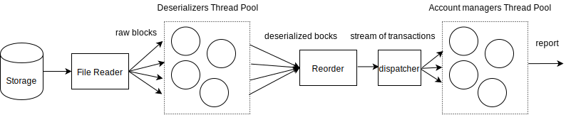

Simulates transaction handling on a list of clients.
The application is benchmarked o a Ryzen 5 3600, with 6 cores and 12 threads.


### Assumptions

In the application we have the following assumptions:
* Records in the csv file are in the correct (as described in the requirements) format
* A record that cannot be parsed if the requirement above doens't hold is ignored
* Records come from a single, chronologically ordered stream (it can be a from a file, network etc.). It can be extended to multiple concurrent streams, but then the consitency and relative chronological order of transactions in different streams shall be handled
* Any transaction on a locked account is ignored
* There is enough RAM to hold all the transactions. (unbounded crossbeam channel are used as well)
* Withdrawals cannot be disputed (see below)

### Testing and Efficiency

* Tested using unit tests and custom csv files (including auto-generated ones)
* System is safe and should never panic, errors are either logged or ignored depending on scenario
* Errors are returned using anyhow crate
* The dataset is not loaded upfront, but it's read and streamed throguh the data flow pipeline and processed on multiple threads (see below)
* Using abstractions on streams the application can handle transactions streams from any sources
* Efficiency is benchmarked on large auto-generated datasets
* Now it can take more time to actually print the report to stdout than to process it (depending on the number of clients)
* Asynchronous runtimes such as tokio is not used since the problem is heavily CPU bound. Reading from the disk is typically much faster than parsing and inserting things into the hashmap. But that may change in real life when there's a IO to a database, transactions come over the network etc.
* **Note**: The application is optimized to run on a multicore machine and may suffer a performance penalty if there's not enough cores. It's possible to change the implementation slightly to dynamically chose between a single threaded or multithreaded implementations, but it's outside the scope for this problem.


### Transactions math:
trans      | available | held | total
---        | ---       | ---  | ---
deposit    |    +      |  0   | +
withdraw   |    -      |  0   | -
dispute    |    -      |  +   | 0
resolve    |    +      |  -   | 0
chargeback |    0      |  -   | -

0 => doesn't change, + => increase, => decrease

### Why disputing withdrawals is not supported

Example:
1) deposit 10$ => 10$ 0$ 10$
2) withdraw 5$ =>  5$ 0$  5$
3) dispute withdrawal (by requirements, total remains the same)
    * negative held => 10$ -5$ 5$
        * can't happen, because we now have 10$ available for withdraw, though we already removed 5$. Or, we can forbid withdrawals if we have insufficient total funds, but then that is contradicting the requirements.
    * positive held => 0$ 5$ 5$
        * at the resolve it's fine, we go back to 5$ 0 5$, nothing reversed
        * at chargeback: 0$ 0$ 0$, but the initial state was 10$ 0$ 10$, so we lost 5$ again.

The only way to follow the requirements as they're described for each transaction type, is to ignore disputes for withdrawals.

### Main workflow

* Started as test driven development to pass the simple cases
* A single threaded application is built and verified first
* The application is benchmarked, the bottlenecks are investigated and optimized into a multithreaded application
* Tests are written for large datasets (millions of records), with a single client and multiple clients since the performance differs for those

### Multithreaded architecture

The processing pipelined dataflow is based on the results of benchmarks that are run on large datasets (see below).



1) The file reader reads blocks from the sequentially disk (we assume it's we have a single disk so the IO cannot be parallized, in any case, file reading is not the bottleneck)
2) The blocks are dispatched on a thread pool that does the parsing of raw byte blocks into lists of transaction records using csv and serde.
3) Since we do that in parallel and the chronological order matters, a reorder thread receives lists of transactions and reorders them in chronological order, obtaining a stream (iterator) over all transactions.
4) A dispatcher reads the tarnsactions from the stream and dispatches them to a thread pool for processing. Each thread in that pool manages for simplicity a fixed subset of clients. Thus, if only one client is present in the dataset, then only one thread will work on it (since sequential consistency of applying transactions to an account really matters)

### Final results for benchmarking

The number of records is 10 million (only deposits). Reported values are in millions of transactions per second and rounded to the first decimal point

ST = single threaded

MT = multithreaded

#### Reader
reader | Single threaded | Multithreaded
--- | --- | ---
single client | 2.0| 10.0
all clients | 2.0 | 10.0

Thus we get a speed-up of about **x5** on my machine (can be finely tuned depending on the number of cores)


### Full application

When running the benchmark on the application, the stdout reporting stage is omitted.
The table below compares different transaction reader + account manager combination.

application | ST + ST | ST + MT | MT + ST | MT + MT
--- | --- | --- | --- | --- |
single client | 1.4 | 1.4 | 3.8 | 3.7
all clients | 1.4 | 1.8 | 3.5 | 6.6

Thus if we have a single client, then we do not parallelize the transactions processing and we have a speedup of around **x2.6**. For multiple accounts the speedup is around **x4.7** vs a fully single threaded application.


### Basic Benchmarking:

#### Compare how long it takes to read a raw file vs to read it and parse using csv and serde

```
[2021-07-22T18:47:09Z DEBUG paytoy::bench] Time to read the raw file: 27.924ms
[2021-07-22T18:47:09Z DEBUG paytoy::transactions_reader] STBulkReader reading the transactions
[2021-07-22T18:47:11Z DEBUG paytoy::transactions_reader] Read 1000000 records in 1.3908061s. Throughput: 0.7190074 millions/second
```

**Results**: CSV Serde is much slower ~50 times

**Conclusion**: IO is not the bottleneck, serialization and parsing is.
